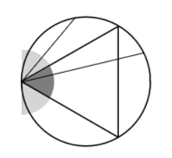
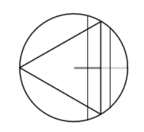

# Minkowski Functionals and Integral Geometry

## Introduction

Minkowski Functionals are a set of mathematical tools used to analyze the shape and structure of data in a variety of fields, including cosmology and astrophysics. Originating from integral geometry, these functionals measure geometric properties of sets and can describe the morphology of complex structures. In cosmology, Minkowski Functionals are particularly valuable for studying the large-scale structure of the universe, such as the distribution of galaxies and the cosmic web. They help quantify properties like the number, size, and connectivity of cosmic structures, providing insights into the underlying physical processes and the validity of cosmological models.

In the study of the interstellar medium (ISM), Minkowski Functionals are employed to identify and characterize filamentary structures. These filaments, which are crucial for understanding the formation of stars and galaxies, can be challenging to detect due to their intricate and often diffuse nature. By applying Minkowski Functionals to observational data, researchers can effectively quantify the shape and distribution of these filaments, helping to elucidate their role in the ISM and improve our understanding of cosmic structure formation.

In order to understand Minkowski Functionals, a Basic understanding of Integral Geometry is also required, so some of the relevant points from Integral Geometry are also discussed here.

My primary references that I used when learning were the following:

1. Minkowski Functionals in Cosmology, Schmalzing et al. [@schmalzing1995minkowskifunctionalscosmology],
2. Wikipedia page for Minkowski Functionals, [@wiki:Minkowski_functional]


## A few basic defintions

**Functional:** A Function mapping from a Space $X$ to either Real or Complex Numbers. An example would be Linear Forms, ie, a mapping of a Vector Space to it's scalar field. 

**Hausdorff metric:**  It quantifies how far apart the sets are by considering the worst-case scenario of points in each set relative to the other. The Hausdorff metric is defined for two non-empty subsets \(A\) and \(B\) of a metric space \((X, d)\). It is given by:

\begin{equation} d_H(A, B) = \max \left\{ \sup_{a \in A} \inf_{b \in B} d(a, b), \sup_{b \in B} \inf_{a \in A} d(a, b) \right\}. \end{equation}

**Manifold:** A manifold is a topological space that locally resembles Euclidean space. More precisely, each point on a manifold has a neighborhood that is homeomorphic (i.e., topologically equivalent) to an open subset of $\mathbb{R}^n$

**Groups:** A **Group** is a set \( G \) equipped with a binary operation \( \cdot \) (often called multiplication) that satisfies the following four axioms:

1. **Closure**: For all \( a, b \in G \), the result of the operation \( a \cdot b \) is also in \( G \).
2. **Associativity**: For all \( a, b, c \in G \), \( (a \cdot b) \cdot c = a \cdot (b \cdot c) \).
3. **Identity Element**: There exists an element \( e \in G \) such that for every element \( a \in G \), \( e \cdot a = a \cdot e = a \).
4. **Inverse Element**: For each \( a \in G \), there exists an element \( b \in G \) such that \( a \cdot b = b \cdot a = e \), where \( e \) is the identity element.


**Ring:** A **Ring** is a set \( R \) equipped with two binary operations, usually called addition (+) and multiplication (·), such that:

1. **$(R, +)$** is an abelian group. This means:
   - **Closure**: For all \( a, b \in R \), \( a + b \in R \).
   - **Associativity**: For all \( a, b, c \in R \), \( (a + b) + c = a + (b + c) \).
   - **Identity Element (Additive Identity)**: There exists an element \( 0 \in R \) such that for every element \( a \in R \), \( a + 0 = 0 + a = a \).
   - **Inverse Element (Additive Inverse)**: For each \( a \in R \), there exists an element \( -a \in R \) such that \( a + (-a) = (-a) + a = 0 \).
   - **Commutativity**: For all \( a, b \in R \), \( a + b = b + a \).
2. **$(R, ·)$** is a semigroup. This means:
   - **Closure**: For all \( a, b \in R \), \( a \cdot b \in R \).
   - **Associativity**: For all \( a, b, c \in R \), \( (a \cdot b) \cdot c = a \cdot (b \cdot c) \).
3. **Distributive Property**: Multiplication is distributive over addition. For all \( a, b, c \in R \):
   - \( a \cdot (b + c) = (a \cdot b) + (a \cdot c) \)
   - \( (a + b) \cdot c = (a \cdot c) + (b \cdot c) \)


**Field:** A **Field** is a set \( F \) equipped with two binary operations, addition (+) and multiplication (·), such that:

1. **$(F, +)$** is an abelian group (satisfies the same properties as above for addition in a ring).
2. **$(F \setminus \{0\}, ·)$** is an abelian group. This means:
   - **Closure**: For all \( a, b \in F \setminus \{0\} \), \( a \cdot b \in F \setminus \{0\} \).
   - **Associativity**: For all \( a, b, c \in F \setminus \{0\} \), \( (a \cdot b) \cdot c = a \cdot (b \cdot c) \).
   - **Identity Element (Multiplicative Identity)**: There exists an element \( 1 \in F \) (with \( 1 \neq 0 \)) such that for every element \( a \in F \setminus \{0\} \), \( a \cdot 1 = 1 \cdot a = a \).
   - **Inverse Element (Multiplicative Inverse)**: For each \( a \in F \setminus \{0\} \), there exists an element \( b \in F \setminus \{0\} \) such that \( a \cdot b = b \cdot a = 1 \).
   - **Commutativity**: For all \( a, b \in F \setminus \{0\} \), \( a \cdot b = b \cdot a \).
3. **Distributive Property**: Multiplication is distributive over addition (same as in a ring).

**Euler Characteristic:** The Euler characteristic is a topological invariant that quantifies the "shape" or "complexity" of a space. The Euler characteristic \(\chi\) of a topological space \(X\) is a number that describes the structure of \(X\). For a finite, compact space \(X\), it can be computed using the formula:

\[
\chi(X) = \sum_{i=0}^{n} (-1)^i \text{rank}(H_i(X))
\]

where \(H_i(X)\) denotes the \(i\)-th homology group of \(X\).


## Bertrand's Paradox:
The Bertrand paradox is a problem within the classical interpretation of probability theory. Joseph Bertrand introduced it in his work Calcul des probabilités (1889) as an example to show that the principle of indifference may not produce definite, well-defined results for probabilities if it is applied uncritically when the domain of possibilities is infinite.

In an attempt to solve this problem, Henri Poincare suggested to overcome such ambiguities by tying probability measures to geometric groups. This was later developed systematically by Minkowski, which later evolved into the field of Integral Geometry, or Geometric Probability Theory.

Reference for this section: Wikipedia: Bertrand Paradox (Probability) [@wiki:Bertrand_paradox]

### Problem Statement

The Bertrand paradox is generally presented as follows: Consider an equilateral triangle inscribed in a circle. Suppose a chord of the circle is chosen at random. What is the probability that the chord is longer than a side of the triangle? 

Classically, There are many ways to construct the sample space for this probability question, but we'll be looking at two of them.

### Method 1 

Choose any point on the circle. A chord going through this point can have an angle between $0$ and $\pi$ radians with the tangent. 

Without Loss of generality, let one of the vertices of the inscribed equilateral triangle be at this point. The sides of the equilateral triangle coming from this point are forming angles of $\pi / 3$ and $2\pi / 3$ respectively.
For the chord to be longer than the sides of the triangle, it must be a part of the range between the two sides of the triangle, and thus giving a probability of $\frac 1 3$

```{r, echo=FALSE, fig.cap="Illustration showing the sample space construction for method 1"}

```

### Method 2 

This method requires 2 observations: 
1. The radius of the circle bisects any chord.
2. The radius is bisected by the side of the equilateral triangle.

```{r, echo=FALSE, fig.cap="Illustration showing the sample space construction for method 2"}

```

Randomly construct a chord, and the chord could have a perpendicular distance to the center of either greater than $\frac r 2$ or less than $\frac r 2$, thus giving you a probility of the chord being longer than the side of the triangle as $\frac 1 2$.


## A Diatribe on Topolgy and Functional Analysis

I don't know how to title this section. Just throwing a few seemingly relevant topics on the wall.

### Manifold with a Group of Transformations

A manifold is a topological space that locally resembles Euclidean space. More precisely, each point on a manifold has a neighborhood that is homeomorphic (i.e., topologically equivalent) to an open subset of $\mathbb{R}^n$.
Manifolds can be equipped with additional structures, such as smoothness or differentiability, which make them important in many areas of mathematics and physics.

A group of transformation $G$ acting on a manifold $M$ is a group where each element of $G$ corresponds to a transformation of the manifold. In other words, each element of $G$ is associated with a function that maps points on $M$ to other points on $M$. 

The group \( G \) acts on the manifold \( M \) if there is a map:
\[ \phi: G \times M \to M \] such that for each \( g \in G \) and \( x \in M \), \( \phi(g, x) \) gives a new point on \( M \). This map satisfies:

1. **Identity**: The identity element \( e \) of \( G \) acts as the identity transformation on \( M \), meaning \( \phi(e, x) = x \) for all \( x \in M \).
2. **Compatibility**: For all \( g, h \in G \) and \( x \in M \), \( \phi(g \cdot h, x) = \phi(g, \phi(h, x)) \), where \( \cdot \) denotes the group operation.


### Compact Convex Set

A set \( C \) in a vector space is called **convex** if, for any two points \( x \) and \( y \) in \( C \), the line segment joining \( x \) and \( y \) is also contained in \( C \). More formally, \( C \) is convex if, for every \( x, y \in C \) and for every \( \lambda \) in the interval \([0,1]\), the point \(\lambda x + (1 - \lambda) y\) is in \( C \). 

A set \( K \) in a topological space (like a Euclidean space) is called **compact** if every open cover of \( K \) has a finite subcover. In simpler terms, \( K \) is compact if it is closed (contains all its limit points) and bounded (fits within some finite region). In Euclidean spaces, compactness is often characterized by these two conditions: a set is compact if and only if it is closed and bounded.


Combining these two ideas:

- A **compact convex set** is a set that is both convex and compact.
- **Convexity** ensures that any line segment between two points in the set remains within the set.
- **Compactness** ensures that the set is bounded and closed, so it does not stretch out infinitely and contains all its boundary points.


## Hadwiger's Theorem

In integral geometry, Hadwiger's theorem characterizes the valuations on convex bodies on $\mathbb{R}^n$. Reference for this section: [@hadwiger_theorem]

We're looking at a Manifold with a group of transformations $G$. Usually we take a $d$ dimensional Euclidean space with a group of transformations being Rotations and translations.
Consider the set of $\mathbb{K}$ convex bodies embedded in this space, and as an extension, a convex ring $R$ of all finite unions of the convex bodies. Suppose you want to characterize a body $B$ on the convex ring, you look for functionals $M$ which satisfy the following requirements:

1. **Motion Invariance:** The functional is Independent of the Body's Position and Orientation in space, ie is Independent of the rotation and translation transformations.
\begin{equation}M(gB) = M(B) \:\:\: \forall g \in G, B \in R\end{equation}
2. **Additivity:** Uniting two bodies adds their functionals, minus the functional of the intersection. This is basically the inclusion-exclusion principle applied here.
\begin{equation}M\left(B_{i\ }\cup B_j\ \right)+M\left(B_{i\ }\cap B_j\right)=\ M\left(B_i\right)\ +\ M\left(B_j\right)\end{equation}
3. **Conditional Continuity:** The functions of convex approximations to a convex body converge to the functionals of the body.
\begin{equation}M(K_i) \rightarrow M(K)  \text{ as } K_i \rightarrow K \text{ for } K, K_i \in \mathbb{K}\end{equation}

Given these conditions, the Hadwiger's Theorem states that given a $d$ dimensional space, there are only $d+1$ such functionals that are independent, meaning Minkowski Functionals are unique and complete. (This statement needs proof)

**Hadwiger's Theorem:** Let $R$ be the convex ring embedded in $d$-dimensional space. Then there exists $d+1$ functionals $M_\mu, \:\: \mu = 0,... d$ on $R$ such that any functional $M$ on $R$ is motion invariant, additive, and conditionally continious can be expressed as a linear combination of the $M_\mu$.
\begin{equation}
M = \sum _ {\mu = 0} ^{d} c_\mu M_\mu
\end{equation}

The most common notations are $M_\mu, V_\mu, \bar {V _\mu} \text{ and } W_\mu$

\begin{equation}
V_\mu = \frac{\omega_{d-\mu}}{\omega_d} M_\mu
\end{equation}

\begin{equation}
\bar{V}_{d-\mu} = \frac{\omega_{d-\mu}}{\omega_d} \begin{pmatrix} d \\ \mu \end{pmatrix} M_\mu
\end{equation}

\begin{equation}
W_\mu = \frac{\omega_\mu \omega_d}{\omega_{d - \mu}} M_\mu
\end{equation}

Where the term $\omega_\mu$ represents the volume of the $\mu$ dimensional unit ball, given by the following formula:
\begin{equation}
\omega_\mu = \frac{\pi ^ \frac{\mu}{2}}{\Gamma(1 + \frac d 2)}
\end{equation}

In the three dimensional Eucledian space, the functionals have a direct geometric interpretation, which is listed out in the below table. 


| geometric quantity             | $\mu$ | $M_\mu$                       | $V_\mu$                       | $W_\mu$                       | $\bar{V}_{3 - \mu}$          | $\omega_\mu$                  |
|--------------------------------|-------|-------------------------------|-------------------------------|-------------------------------|------------------------------|-------------------------------|
| $V$ volume                      | 0     | $V$                           | $V$                           | $V$                           | $V$                          | 1                             |
| $A$ surface                     | 1     | $\frac{A}{8}$                 | $\frac{A}{6}$                 | $\frac{A}{3}$                 | $\frac{A}{2}$                | 2                             |
| $H$ mean curvature              | 2     | $\frac{H}{2\pi^2}$            | $\frac{H}{3\pi}$              | $\frac{H}{3}$                 | $\frac{H}{\pi}$              | $\pi$                          |
| $\chi$ Euler characteristic     | 3     | $\frac{3\chi}{4\pi}$          | $\chi$                        | $\frac{4\pi\chi}{3}$          | $\chi$                        | $\frac{4\pi}{3}$              |

## Principal Kinematical Formula of Integral Geometry

One of the challenges we face is calculation of mean values over motions of bodies. In order to integrate over a group of motions, we define a measure $dg$, that is invariant under motion (translation and rotations), called the _Haar Measure_. 

Taking two bodies $A$ and $B$ from the convex ring $R$, and a transformation $g$ from the group of motions $G$, the resulting intersection $A \cap gB$ is again a member of the convex rign and has the Minkowski functionals $M_\mu (A \cap gB)$. Given a Haar measure, we can then calculate the mean value of the Functional over the group of motions with just the functionals of $A$ and $B$ alone, using the **Principal Kinematical Formula**

\begin{equation}
\int_G dg M_\mu (A \cap gB) = \sum _{\nu = 0} ^{\mu} \begin{pmatrix}\mu \\ \nu \end{pmatrix} M_\nu (A) M_{\mu - \nu}(B)
\end{equation}